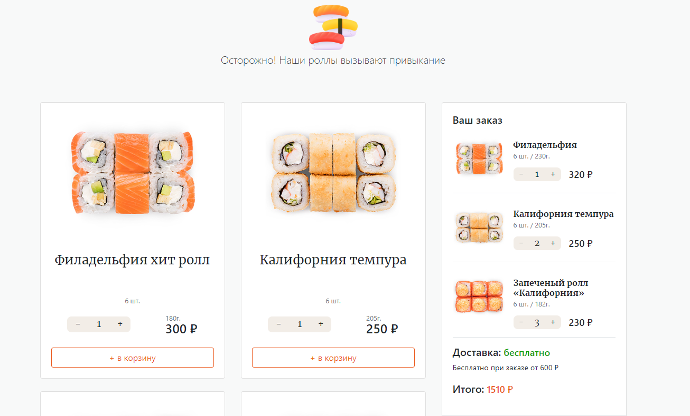

Проект, где пользователь может выбрать суши, которые он хочет доставить, а также её количество. После того, как пользователь добавил товар в корзину, он видит стоимость товаров и сумму доставки.Товары беруться из json-файла 
 

